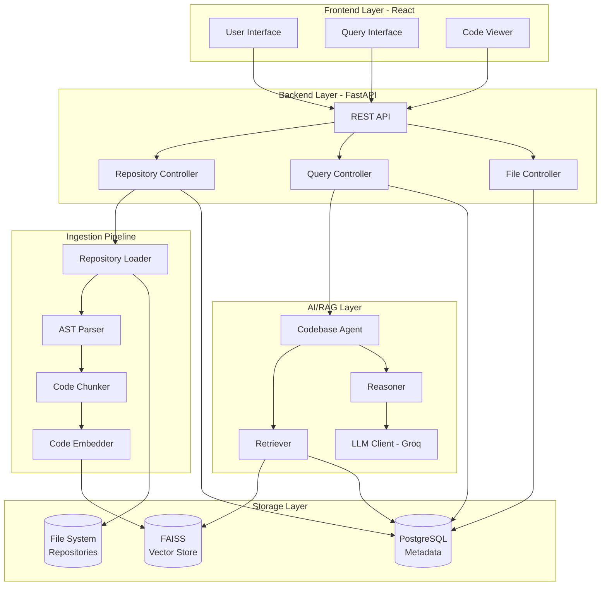
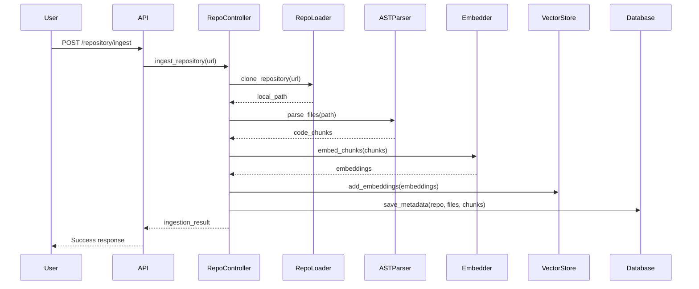
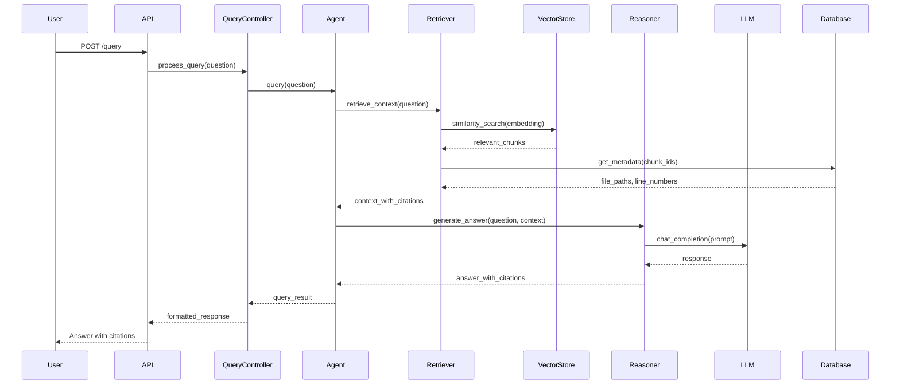
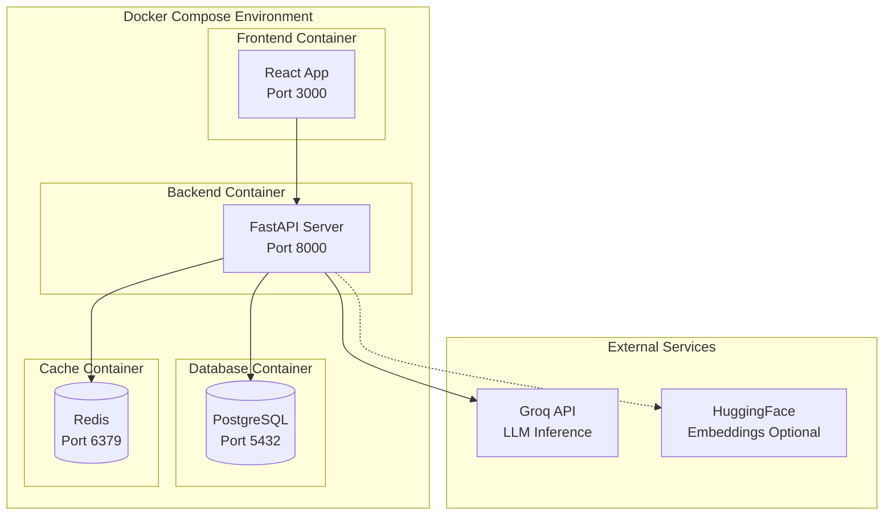

# High-Level Design (HLD)
## AI Codebase Onboarding Assistant

### 1. System Overview

The AI Codebase Onboarding Assistant is an intelligent system designed to help developers quickly understand and navigate new codebases using AI-powered analysis and natural language queries. The system uses Retrieval-Augmented Generation (RAG) to provide context-aware answers about code structure, dependencies, and functionality.

#### Objectives
- **Rapid Onboarding**: Reduce time for developers to understand new codebases from days to hours
- **Natural Language Queries**: Enable developers to ask questions in plain English about code functionality
- **Code Navigation**: Provide intelligent code search and execution flow analysis
- **Citation-Backed Responses**: All AI responses include file paths and line numbers for verification

---

### 2. Architecture Components

---

### 3. Component Descriptions

#### 3.1 Frontend (React + Vite)
- **Technology**: React 19, Vite, TailwindCSS
- **Responsibilities**:
  - User interface for repository submission
  - Natural language query input
  - Display AI-generated responses with code citations
  - Code visualization and navigation
  - Execution flow diagram rendering

#### 3.2 Backend API (FastAPI)
- **Technology**: FastAPI, Python 3.9+
- **Key Features**:
  - RESTful API endpoints
  - Asynchronous request handling
  - CORS support for frontend integration
  - Swagger/OpenAPI documentation
- **Controllers**:
  - `RepositoryController`: Handles repository ingestion
  - `QueryController`: Processes natural language queries
  - `FileController`: Retrieves file content and metadata

#### 3.3 AI/RAG Layer
- **Codebase Agent**: Orchestrates RAG pipeline
- **Retriever**: Semantic search using vector embeddings
- **Reasoner**: LLM-based analysis and response generation
- **LLM Client**: Interface to Groq API (free tier available)

#### 3.4 Ingestion Pipeline
- **Repository Loader**: Clones Git repositories
- **AST Parser**: Extracts code structure using Tree-sitter
  - Supports Python and JavaScript
  - Identifies functions, classes, variables, imports
- **Code Chunker**: Splits code into semantic chunks
- **Code Embedder**: Generates vector embeddings
  - Supports HuggingFace (free) or OpenAI (paid)

#### 3.5 Storage Layer
- **PostgreSQL**: Stores metadata (repositories, files, chunks)
- **FAISS**: High-performance vector similarity search
- **File System**: Local storage for cloned repositories

---

### 4. Data Flow

#### 4.1 Repository Ingestion Flow

#### 4.2 Query Processing Flow

---

### 5. Technology Stack

#### Backend
| Component | Technology | Purpose |
|-----------|-----------|---------|
| Framework | FastAPI 0.109 | REST API server |
| Runtime | Python 3.9+ | Backend logic |
| Database | PostgreSQL 15 | Metadata storage |
| Vector DB | FAISS | Similarity search |
| LLM | Groq API | Response generation (free) |
| Embeddings | HuggingFace / OpenAI | Vector embeddings |
| AST Parser | Tree-sitter | Code parsing |
| Git | GitPython | Repository cloning |

#### Frontend
| Component | Technology | Purpose |
|-----------|-----------|---------|
| Framework | React 19 | UI components |
| Build Tool | Vite 7 | Fast dev server & bundling |
| Styling | TailwindCSS 4 | Utility-first CSS |
| Icons | Lucide React | Icon library |
| HTTP Client | Fetch API | Backend communication |

#### Infrastructure
| Component | Technology | Purpose |
|-----------|-----------|---------|
| Containerization | Docker | App deployment |
| Orchestration | Docker Compose | Multi-service setup |
| Cache | Redis | Query result caching (optional) |

---

### 6. Security Considerations

#### 6.1 Input Validation
- Git URL validation to prevent malicious repositories
- File size limits (default: 10MB per file)
- Sandboxed repository cloning

#### 6.2 API Security
- CORS configuration for trusted origins
- Rate limiting on API endpoints
- Environment variable protection (`.env` files)

#### 6.3 Data Privacy
- Repository data stored locally
- No code uploaded to third parties (except LLM queries)
- Groq API: Code snippets sent for analysis (subject to their privacy policy)

#### 6.4 Access Control
- Future: Add authentication for multi-user deployments
- Current: Single-user local deployment

---

### 7. Scalability Considerations

#### 7.1 Current Architecture
- **Deployment**: Single-server deployment via Docker
- **Storage**: Local file system + PostgreSQL + FAISS
- **Performance**: Suitable for individual developers or small teams

#### 7.2 Future Enhancements
- **Distributed Vector Store**: Migrate FAISS to Pinecone/Weaviate for cloud scale
- **Microservices**: Separate ingestion and query services
- **Message Queue**: Use Celery/RabbitMQ for async ingestion
- **Caching**: Redis for frequently queried responses
- **Multi-tenancy**: Support multiple users with separate repositories

---

### 8. Quality Attributes

| Attribute | Target | Approach |
|-----------|--------|----------|
| **Availability** | 99% uptime | Docker deployment with health checks |
| **Performance** | < 2s query response | Vector similarity search + caching |
| **Accuracy** | High relevance | RAG with semantic chunking |
| **Extensibility** | Easy language additions | Pluggable AST parsers |
| **Maintainability** | Modular design | Separation of concerns |

---

### 9. Deployment Architecture

---

### 10. Integration Points

#### 10.1 External APIs
- **Groq API**: LLM inference for query answering
- **OpenAI API** (optional): Alternative embeddings provider
- **GitHub**: Repository cloning (public repos)

#### 10.2 Internal Services
- PostgreSQL for metadata persistence
- FAISS for vector similarity search
- Redis for query result caching (optional)

---

### 11. Future Roadmap

1. **Multi-language Support**: Add support for Java, Go, TypeScript, Rust
2. **IDE Integration**: VSCode extension for in-editor queries
3. **Team Collaboration**: Multi-user support with shared repositories
4. **Custom Models**: Fine-tuned code-specific LLMs
5. **Code Generation**: Suggest code snippets based on queries
6. **Incremental Updates**: Monitor repos and update embeddings on changes
