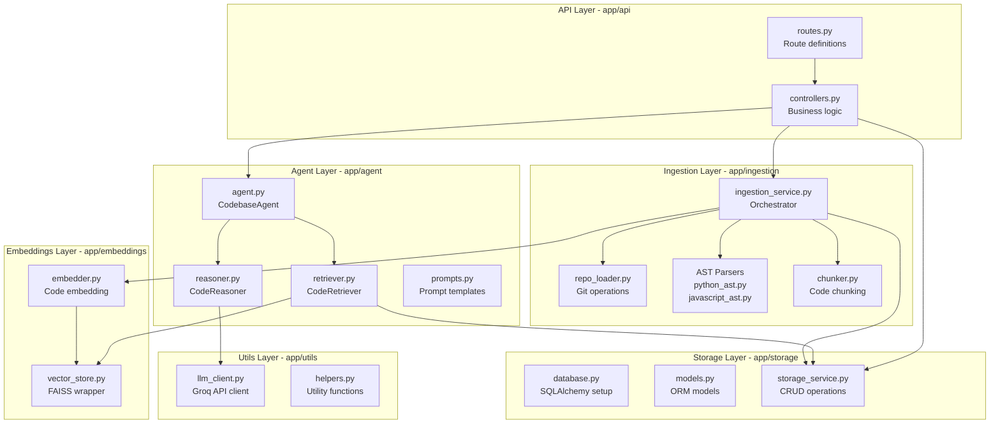
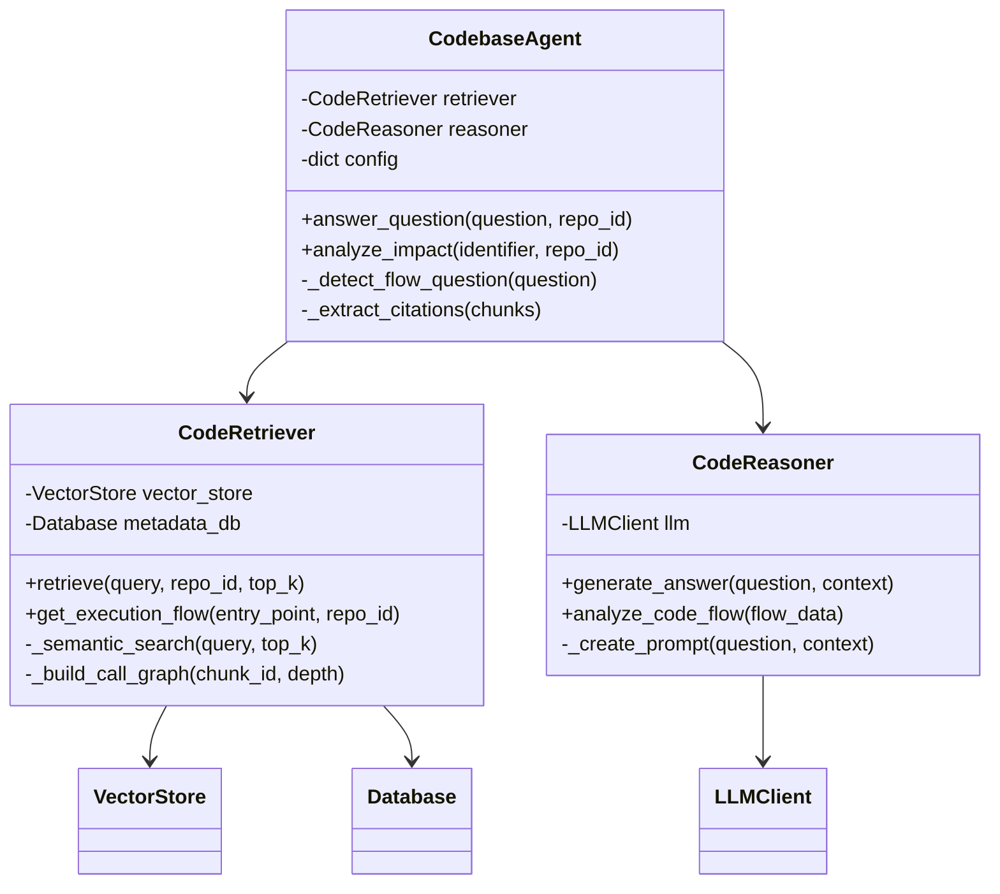
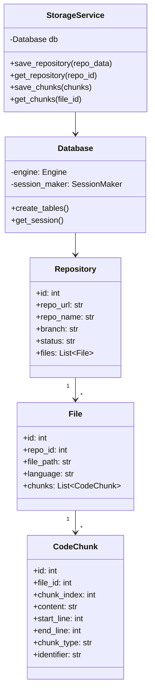

# Low-Level Design (LLD)
## AI Codebase Onboarding Assistant

### 1. Module Architecture



---

### 2. Database Schema

```sql
-- Repositories table
CREATE TABLE repositories (
    id SERIAL PRIMARY KEY,
    repo_url VARCHAR(500) NOT NULL UNIQUE,
    repo_name VARCHAR(255) NOT NULL,
    branch VARCHAR(100) DEFAULT 'main',
    local_path VARCHAR(500),
    status VARCHAR(50),  -- 'pending', 'processing', 'completed', 'failed'
    created_at TIMESTAMP DEFAULT CURRENT_TIMESTAMP,
    updated_at TIMESTAMP DEFAULT CURRENT_TIMESTAMP,
    metadata JSONB  -- Additional metadata
);

-- Files table
CREATE TABLE files (
    id SERIAL PRIMARY KEY,
    repo_id INTEGER REFERENCES repositories(id) ON DELETE CASCADE,
    file_path VARCHAR(1000) NOT NULL,
    language VARCHAR(50),
    size_bytes INTEGER,
    line_count INTEGER,
    created_at TIMESTAMP DEFAULT CURRENT_TIMESTAMP,
    UNIQUE(repo_id, file_path)
);

-- Code chunks table
CREATE TABLE code_chunks (
    id SERIAL PRIMARY KEY,
    file_id INTEGER REFERENCES files(id) ON DELETE CASCADE,
    chunk_index INTEGER NOT NULL,
    content TEXT NOT NULL,
    start_line INTEGER,
    end_line INTEGER,
    chunk_type VARCHAR(50),  -- 'function', 'class', 'module', 'snippet'
    identifier VARCHAR(255),  -- Function/class name if applicable
    embedding_id VARCHAR(100),  -- Reference to vector store
    created_at TIMESTAMP DEFAULT CURRENT_TIMESTAMP,
    UNIQUE(file_id, chunk_index)
);

-- Execution flow edges (for call graph)
CREATE TABLE execution_flow (
    id SERIAL PRIMARY KEY,
    repo_id INTEGER REFERENCES repositories(id) ON DELETE CASCADE,
    caller_chunk_id INTEGER REFERENCES code_chunks(id),
    callee_chunk_id INTEGER REFERENCES code_chunks(id),
    call_type VARCHAR(50),  -- 'function_call', 'import', 'inheritance'
    created_at TIMESTAMP DEFAULT CURRENT_TIMESTAMP
);

-- Indexes for performance
CREATE INDEX idx_files_repo_id ON files(repo_id);
CREATE INDEX idx_chunks_file_id ON code_chunks(file_id);
CREATE INDEX idx_chunks_identifier ON code_chunks(identifier);
CREATE INDEX idx_flow_caller ON execution_flow(caller_chunk_id);
CREATE INDEX idx_flow_callee ON execution_flow(callee_chunk_id);
```

---

### 3. API Endpoints Specification

#### 3.1 Health Check
```http
GET /api/v1/health
```
**Response:**
```json
{
  "status": "healthy",
  "database": "connected",
  "vector_store": "ready"
}
```

#### 3.2 Ingest Repository
```http
POST /api/v1/repository/ingest
Content-Type: application/json

{
  "repo_url": "https://github.com/user/repo",
  "branch": "main"
}
```
**Response:**
```json
{
  "repo_id": "user_repo",
  "status": "processing",
  "message": "Repository ingestion started",
  "stats": {
    "files_processed": 0,
    "chunks_created": 0
  }
}
```

#### 3.3 Get Repository Status
```http
GET /api/v1/repository/{repo_id}/status
```
**Response:**
```json
{
  "repo_id": "user_repo",
  "status": "completed",
  "stats": {
    "total_files": 45,
    "total_chunks": 320,
    "languages": ["python", "javascript"]
  }
}
```

#### 3.4 Query Codebase
```http
POST /api/v1/query
Content-Type: application/json

{
  "question": "How does authentication work?",
  "repo_id": "user_repo",
  "include_execution_flow": true,
  "top_k": 10
}
```
**Response:**
```json
{
  "answer": "Authentication is handled by the AuthService class...",
  "confidence": "high",
  "citations": [
    {
      "file": "backend/auth/service.py",
      "lines": [15, 42],
      "snippet": "class AuthService:\n    def authenticate(user, password)..."
    }
  ],
  "execution_flow": [
    {
      "function": "login",
      "file": "routes.py",
      "calls": ["authenticate", "generate_token"]
    }
  ]
}
```

#### 3.5 Get File Content
```http
GET /api/v1/file?repo_id=user_repo&file_path=backend/auth/service.py
```
**Response:**
```json
{
  "file_path": "backend/auth/service.py",
  "content": "# File content here...",
  "language": "python",
  "line_count": 150
}
```

---

### 4. Class Diagrams

#### 4.1 Agent Layer Classes


#### 4.2 Storage Layer Classes


---

### 5. Component Details

#### 5.1 CodebaseAgent (app/agent/agent.py)

**Purpose:** Main orchestrator for RAG pipeline

**Key Methods:**
| Method | Parameters | Returns | Description |
|--------|-----------|---------|-------------|
| `answer_question()` | question, repo_id, include_flow | dict | Main entry point for Q&A |
| `analyze_impact()` | identifier, repo_id | dict | Analyze impact of code changes |
| `_answer_simple()` | question, chunks | dict | Simple Q&A without flow |
| `_answer_with_flow()` | question, chunks, repo_id | dict | Q&A with execution flow |
| `_detect_flow_question()` | question | bool | Detect flow-related questions |
| `_extract_citations()` | chunks | list | Extract file/line citations |

**Configuration:**
```python
config = {
    'include_flow': True,
    'max_flow_depth': 5,
    'top_k_results': 10
}
```

#### 5.2 CodeRetriever (app/agent/retriever.py)

**Purpose:** Semantic search and execution flow analysis

**Key Methods:**
| Method | Parameters | Returns | Description |
|--------|-----------|---------|-------------|
| `retrieve()` | query, repo_id, top_k | List[dict] | Retrieve relevant code chunks |
| `get_execution_flow()` | entry_point, repo_id, max_depth | dict | Build call graph |
| `_semantic_search()` | query, top_k | List[str] | Vector similarity search |
| `_build_call_graph()` | chunk_id, depth | dict | Recursive flow analysis |

#### 5.3 CodeEmbedder (app/embeddings/embedder.py)

**Purpose:** Generate vector embeddings for code

**Supported Providers:**
- **HuggingFace** (Free): `sentence-transformers/all-MiniLM-L6-v2`
- **OpenAI** (Paid): `text-embedding-ada-002`

**Key Methods:**
| Method | Parameters | Returns | Description |
|--------|-----------|---------|-------------|
| `embed_text()` | text | List[float] | Single text embedding |
| `embed_batch()` | texts | List[List[float]] | Batch embeddings |
| `dimension` | - | int | Embedding dimension |

#### 5.4 IngestionService (app/ingestion/ingestion_service.py)

**Purpose:** Orchestrate repository ingestion pipeline

**Pipeline Steps:**
1. **Clone Repository** → RepositoryLoader
2. **Parse Files** → AST Parsers (Python/JavaScript)
3. **Chunk Code** → CodeChunker
4. **Generate Embeddings** → CodeEmbedder
5. **Store Data** → StorageService + VectorStore

**Key Methods:**
| Method | Parameters | Returns | Description |
|--------|-----------|---------|-------------|
| `ingest_repository()` | repo_url, branch | dict | Full ingestion pipeline |
| `_parse_files()` | repo_path | List[dict] | Extract code structures |
| `_chunk_code()` | parsed_data | List[dict] | Create semantic chunks |

---

### 6. AST Parsing Details

#### 6.1 Python AST Parser (app/ingestion/python_ast.py)

**Extracted Elements:**
- Classes (with docstrings, methods)
- Functions (with signatures, docstrings)
- Imports and dependencies
- Global variables and constants

**Example Output:**
```json
{
  "type": "function",
  "name": "authenticate_user",
  "signature": "authenticate_user(username: str, password: str) -> bool",
  "docstring": "Verify user credentials against database",
  "start_line": 15,
  "end_line": 42,
  "dependencies": ["hashlib", "database.User"]
}
```

#### 6.2 JavaScript AST Parser (app/ingestion/javascript_ast.py)

**Extracted Elements:**
- Functions (arrow functions, regular functions)
- Classes (ES6 classes)
- Imports/Exports (ES6 modules)
- Variable declarations

---

### 7. Vector Store Architecture

#### 7.1 FAISS Configuration
- **Index Type:** HNSW (Hierarchical Navigable Small World)
- **Metric:** Cosine similarity
- **Dimensions:** 384 (HuggingFace) or 1536 (OpenAI)

#### 7.2 Operations
```python
# Add embeddings
vector_store.add_embeddings(
    embeddings=[[0.1, 0.2, ...], ...],
    ids=["chunk_1", "chunk_2", ...]
)

# Search
results = vector_store.search(
    query_embedding=[0.15, 0.22, ...],
    top_k=10
)
# Returns: [(chunk_id, similarity_score), ...]
```

---

### 8. LLM Integration

#### 8.1 Groq API Client (app/utils/llm_client.py)

**Configuration:**
```python
{
    "api_key": "gsk_...",
    "model": "llama-3.1-70b-versatile",
    "temperature": 0.1,
    "max_tokens": 2000
}
```

**Supported Models:**
- `llama-3.1-70b-versatile` (Recommended)
- `mixtral-8x7b-32768`
- `gemma-7b-it`

#### 8.2 Prompt Engineering

**System Prompt:**
```
You are an AI assistant specialized in code understanding.
Analyze the provided code snippets and answer questions 
accurately with citations [file:line].
```

**User Prompt Template:**
```
Question: {question}

Relevant Code:
{code_chunk_1}
{code_chunk_2}
...

Provide a clear, concise answer with file citations.
```

---

### 9. Error Handling

#### 9.1 Error Codes
| Code | Description | HTTP Status |
|------|-------------|-------------|
| `REPO_CLONE_FAILED` | Git clone error | 400 |
| `REPO_NOT_FOUND` | Repository doesn't exist | 404 |
| `PARSE_ERROR` | AST parsing failed | 500 |
| `EMBEDDING_ERROR` | Embedding generation failed | 500 |
| `LLM_ERROR` | LLM API error | 503 |
| `DB_ERROR` | Database error | 500 |

#### 9.2 Error Response Format
```json
{
  "error": {
    "code": "REPO_CLONE_FAILED",
    "message": "Failed to clone repository",
    "details": "Repository URL is invalid or private"
  }
}
```

---

### 10. Performance Optimizations

#### 10.1 Caching Strategy
- **Query Results**: Cache frequent queries for 1 hour
- **Embeddings**: Persist in FAISS index
- **Metadata**: PostgreSQL with indexes

#### 10.2 Batch Processing
- **Embedding Generation**: Process 32 chunks at a time
- **Database Inserts**: Bulk insert via SQLAlchemy

#### 10.3 Async Operations
- Repository cloning: Async background task
- File parsing: Parallel processing for large repos

---

### 11. Testing Strategy

#### 11.1 Unit Tests
- AST parsers (Python, JavaScript)
- Code chunker logic
- Vector store operations
- LLM client mocking

#### 11.2 Integration Tests
- End-to-end ingestion pipeline
- Query processing with mocked LLM
- Database operations

#### 11.3 Test Files Location
```
backend/app/tests/
├── test_ast_parsers.py
├── test_chunker.py
├── test_embeddings.py
├── test_agent.py
└── test_api.py
```

---

### 12. Configuration Management

#### 12.1 Environment Variables
All settings loaded from `.env` via Pydantic Settings:
```python
class Settings(BaseSettings):
    API_HOST: str = "0.0.0.0"
    API_PORT: int = 8000
    GROQ_API_KEY: str
    EMBEDDING_PROVIDER: str = "huggingface"
    TOP_K_RESULTS: int = 10
    # ... more settings
```

#### 12.2 Runtime Configuration
Agent and retriever settings can be configured at runtime:
```python
agent = CodebaseAgent(
    llm=llm_client,
    vector_store=vector_store,
    metadata_db=database,
    config={
        'include_flow': True,
        'max_flow_depth': 5,
        'top_k_results': 10
    }
)
```
